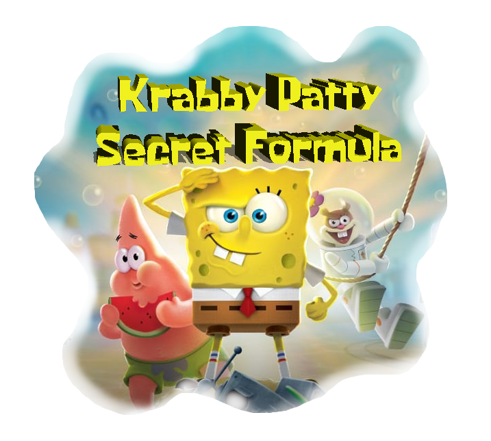

#  Krabby Patty Secret Formula 

# Opis igre :memo: :

Sunđer Bob prolazi kroz različite nivoe, izbegava prepreke i sakuplja sastojke koji čine Tajni recept Kebine pljeske. Svaki završen nivo kao nagradu nosi jedan sastojak. Ukoliko Sunđer Bob ne uspe da završi nivo, Plankton je pobedio i dobio tajni sastojak.

# Programski jezik
  
  

# Okruzenje

# Korisćene biblioteke :books: :
* Qt >= 6.2.2

# Instalacija :hammer: :
**Qt** i **Qt Creator** se mogu preuzeti na [ovom](https://www.qt.io/download) linku. 

# Preuzimanje i pokretanje :wrench: :
1. U terminalu se pozicionirati u zeljeni direktorijum
2. Klonirati repozitorijum komandom: `$ git clone https://gitlab.com/matf-bg-ac-rs/course-rs/projects-2021-2022/10-KrabbyPattySecretFormula.git`
3. Otvoriti okruzenje **Qt Creator** i u njemu otvoriti .pro fajl
4. Pritisnuti dugme **Run** (Ctrl+R) u donjem levom uglu ekrana

# Uputstvo :

U glavnom meniju postoje 4 dugmeta:

- Klikom na dugme **Start game** otvara se prozor za prikaz otkljucanih i zakljucanih nivoa. Prvi nivo je otkljucan, a svaki naredni se otkljucava ukoliko ostvarite poene sakupljajuci sastojke na sceni u prethodnom nivou.
- Klikom na dugme **Settings** mozete podesiti Easy ili Hard mod igre i, po potrebi, iskljuciti muziku tokom igranja nivoa.
- Klikom na dugme **Rang list** mozete videti tabelu 10 najboljih rezultata igraca koji su igrali ovu igricu.
- Klikom na dugme **Quit game** napustate glavni meni izlazite iz igre.

U gornjem desnom uglu glavnog menija se nalazi **Help** dugme koje prikazuje nacin kretanja igraca i cilj igre.

# Demo snimak igrice :movie_camera: :
[Video] ovde cemo ubaciti video

## Developers

- [Jovana Đurović, 290/2018](https://gitlab.com/djurovicj)
- [Danilo Matić, 78/2018](https://gitlab.com/DaniloMatic99)
- [Natalija Asanović, 171/2018](https://gitlab.com/Natalija9)
- [Lucija Miličić, 29/2018](https://gitlab.com/lucijamilicic)
- [Marija Čulić, 269/2018](https://gitlab.com/marijaculic)
